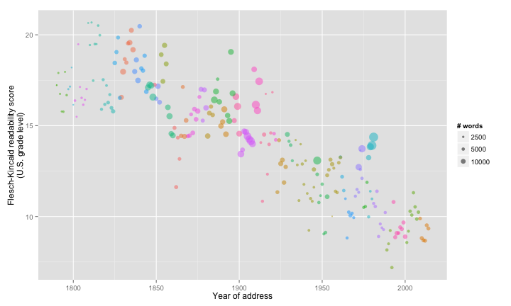

title: "The State of the Union is dumber"
author: "jrnew"
date: "4 October, 2014"
slug: state-of-the-union

I got the idea of calculating the [Fleisch-Kincaid readability test][fk-readability] score for all State of the Union Adresses after reading about how [it was used][beakblog] to calculate the average U.S. grade level of a user's tweets in [Beak][beak]. After some googling, it turns out [The Guardian][guardian] already beat me to it, but this still makes for a fun exercise.


```r
library(XML)
library(stringr)
library(koRpus)
library(ggplot2)
library(gridExtra)
source("R/speech-functions.R")
output_dir <- "output"
# Get list of speech objects
dir.create(output_dir, showWarnings = FALSE)
if (!file.exists(file.path(output_dir, "speech_list_all.rda"))) {
  urls_speech <- GetSpeechURLs()
  speech_list_all <- lapply(urls_speech, GetAndProcessSpeech)
  names(speech_list_all) <- sapply(speech_list_all, function(speech_list) 
    paste(speech_list$speech_data_scalar$president, speech_list$speech_data_scalar$year))
  save(speech_list_all, file = file.path(output_dir, "speech_list_all.rda"))
} else {
  load(file.path(output_dir, "speech_list_all.rda"))
}
# Get speech data frame
if (!file.exists(file.path(output_dir, "speech_df.rda"))) {
  speech_df <- GetSpeechDataFrame(speech_list_all)
  save(speech_df, file = file.path(output_dir, "speech_df.rda"))
} else {
  load(file.path(output_dir, "speech_df.rda"))
}
```

Final plot:

```r
# F-K readability vs year bubble charts
speech_df$num_words_scaled <- sqrt(speech_df$num_words/pi)
p <- ggplot(speech_df, 
            aes_string(x = "year", y = "readability_grade", 
                       color = "president", size = "num_words_scaled")) +
  geom_point(alpha = 0.5) +
  xlab("Year of address") + ylab("Flesch-Kincaid readability score\n(U.S. grade level)") + 
  scale_size_continuous(name = "# words", 
                        breaks = sqrt(c(2500, 5000, 10000)/pi), 
                        labels = c(2500, 5000, 10000)) + 
  scale_colour_hue(guide = FALSE)
print(p)
```

 

[beakblog]: https://medium.com/@johnnylin/going-from-nothing-to-product-hunt-in-4-hours-89cfb67977b3 "Johnny Lin"
[beak]: http://www.beakscore.com/ "Beak"
[fk-readability]: http://en.wikipedia.org/wiki/Flesch%E2%80%93Kincaid_readability_tests "Fleisch-Kincaid readability test"
[guardian]: http://www.theguardian.com/world/interactive/2013/feb/12/state-of-the-union-reading-level "The Guardian"

[Resources]: # (Resources: http://jason.bryer.org/posts/2012-12-10/Markdown_Jekyll_R_for_Blogging.html
http://joshualande.com/jekyll-github-pages-poole/
https://gist.github.com/jeromyanglim/2716336
https://github.com/adam-p/markdown-here/wiki/Markdown-Cheatsheet
https://help.github.com/articles/using-jekyll-with-pages
)
